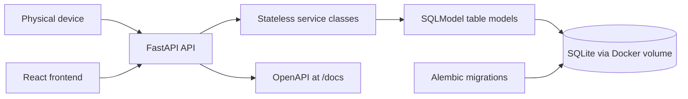

# Tree Nation Visit Tracker

A full-stack service for tracking customer visits and converting visit milestones into planted tree counters. The original product brief is available in [Tech Interview Assessment Spec.pdf](Tech%20Interview%20Assessment%20Spec.pdf).

## Tech Stack

- **Backend**: FastAPI, SQLModel, Alembic, SQLite
- **Frontend**: React, TypeScript, Vite
- **Infrastructure**: Docker Compose

## Prerequisites

- [Docker](https://docs.docker.com/get-docker/) and Docker Compose

## Getting Started

From the repository root:

```bash
cp .env.example .env
docker compose up --build -d
```

| Service | URL |
|---|---|
| Public frontend | http://localhost:5173 |
| Admin dashboard | http://localhost:5173/admin |
| API | http://localhost:8000 |
| OpenAPI docs | http://localhost:8000/docs |

## Configuration

The `.env` file is read automatically by Docker Compose. The tracked `.env.example` documents the available values.

| Variable | Default | Description |
|---|---|---|
| `API_PORT` | `8000` | Host port for the API |
| `FRONTEND_PORT` | `5173` | Host port for the frontend |
| `DATABASE_PATH` | `/data/visits.db` | SQLite file inside the backend container |
| `TEST_DATABASE_PATH` | `/tmp/test-visits.db` | SQLite file used by tests |
| `VISITS_PER_TREE` | `5` | Number of visits per tree milestone |
| `VITE_API_BASE_URL` | `http://localhost:8000` | API URL baked into the frontend build |

After changing `.env`, run `docker compose up --build -d` again. The rebuild is required for `VITE_API_BASE_URL` because Vite embeds it at build time.

## API Reference

### `GET /api/customers` — Customer summary

Returns aggregate metrics and per-customer state.

```json
{
  "total_visits": 505,
  "total_trees_planted": 101,
  "items": [
    {
      "customer_id": "customer-001",
      "visit_count": 87,
      "trees_planted": 17,
      "last_connection_at": "2026-05-25T10:30:00+00:00"
    }
  ]
}
```

### `GET /api/customers/{customer_id}` — Single customer

Returns the state for one customer. Responds with `404` if not found.

```json
{
  "customer_id": "customer-001",
  "visit_count": 87,
  "trees_planted": 17,
  "last_connection_at": "2026-05-25T10:30:00+00:00"
}
```

### `POST /api/visits` — Record a visit

```json
// Request
{ "customer_id": "customer-001", "occurred_at": "2026-05-25T12:00:00Z" }

// Response (201)
{ "customer_id": "customer-001", "visit_count": 88, "trees_planted": 17, "last_connection_at": "2026-05-25T12:00:00+00:00" }
```

`occurred_at` is optional; defaults to the server's current UTC time.

### `GET /api/visits/hourly` — Visits aggregated per hour

Groups all visits by UTC hour. Supports optional `start` and `end` query parameters (ISO 8601).

```json
{
  "items": [
    { "hour": "2026-05-25T09:00:00+00:00", "visit_count": 2 },
    { "hour": "2026-05-25T10:00:00+00:00", "visit_count": 1 }
  ]
}
```

## Tests

```bash
docker compose --profile test build test
docker compose --profile test run --rm test
```

The test service uses `TEST_DATABASE_PATH` from `.env` and does not need a local Python installation.

## Seed Data

On startup, the backend ensures a baseline demo dataset exists: `customer-001` through `customer-010`, each with a generated visit count between `1` and `100`. The seed is idempotent; if those customers already exist, the app does not insert duplicate visits.

To reset the persisted SQLite database and reload the baseline dataset from scratch:

```bash
docker compose down -v
docker compose up --build -d
```

## Architecture



## Assumptions

- `customer_id` is the external identifier provided by the device and exposed by the API. Internally, customers use an integer primary key.
- Visit timestamps are stored and returned in UTC.
- A tree milestone is calculated as `floor(customer visits / VISITS_PER_TREE)`.
- SQLite is sufficient for this scope and is persisted through a Docker volume.
- Schema changes are managed with Alembic migrations over SQLModel table models.

## Decision Document

See [docs/decisions.md](docs/decisions.md) for the technical choices behind this project.
