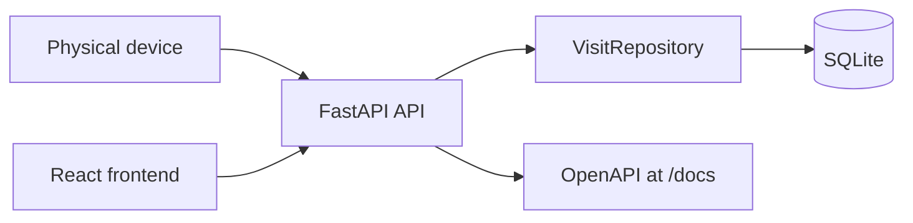

# Tree Nation Visit Tracker

A small full-stack implementation of the assessment in `Tech Interview Assessment Spec.pdf`.

- `backend/`: FastAPI service with SQLite persistence and Docker support.
- `frontend/`: React + TypeScript + Vite dashboard for hourly visit aggregates.

## Run With Docker

```bash
docker compose up --build
```

The frontend runs at http://localhost:5173, the API runs at http://localhost:8000, and the OpenAPI docs are available at http://localhost:8000/docs.

Configuration:

- `DATABASE_PATH`: SQLite file path. Docker Compose uses `/data/visits.db`.
- `VISITS_PER_TREE`: number of visits that equal one planted tree. Default is `5`.

## Backend: Run Tests With Docker

```bash
docker compose --profile test run --rm test
```

## Frontend: Run Locally

Docker is the easiest path for reviewers, but local frontend development still works normally:

```bash
cd frontend
npm install
npm run dev
```

Open http://localhost:5173. The frontend expects the API at `http://localhost:8000` by default. Override it with `VITE_API_BASE_URL` if needed.

## API Usage

Create a visit event:

```bash
curl -X POST http://localhost:8000/api/visits   -H "Content-Type: application/json"   -d '{"customer_id": "customer-123", "occurred_at": "2026-05-25T09:10:00Z"}'
```

If `occurred_at` is omitted, the service uses the current server time in UTC.

Get a customer:

```bash
curl http://localhost:8000/api/customers/customer-123
```

Get hourly aggregates for the frontend:

```bash
curl http://localhost:8000/api/visits/hourly
```

Optional filters:

```bash
curl "http://localhost:8000/api/visits/hourly?start=2026-05-25T00:00:00Z&end=2026-05-26T00:00:00Z"
```

## Assumptions

- `customer_id` is provided by the device and is enough to identify a customer.
- Visit timestamps are stored and returned in UTC.
- A tree milestone is calculated as `floor(customer visits / VISITS_PER_TREE)`.
- SQLite is sufficient for this scope and is persisted through a Docker volume.
- The frontend is a separate local app that communicates with the backend API.

## Architecture



See [docs/decisions.md](docs/decisions.md) for the short decision document.
