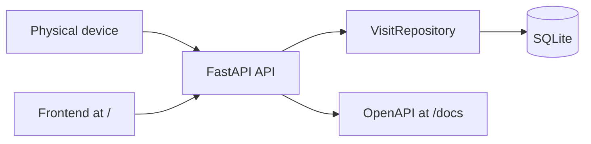

# Tree Nation Visit Tracker

FastAPI service for the assessment: a device sends shop visit events, the service tracks each customer's visits, stores their last connection time, increments planted trees after every configurable number of visits, and serves a simple hourly visits frontend.

## Run With Docker

```bash
docker compose up --build
```

Open http://localhost:8000 for the frontend or http://localhost:8000/docs for OpenAPI documentation.

Configuration:

- `DATABASE_PATH`: SQLite file path. Docker Compose uses `/data/visits.db`.
- `VISITS_PER_TREE`: number of visits that equal one planted tree. Default is `5`.

## Run Tests With Docker

```bash
docker compose --profile test run --rm test
```

The Docker path above is the intended way to run and verify the assessment deliverable.

## API Usage

Create a visit event:

```bash
curl -X POST http://localhost:8000/api/visits \
  -H "Content-Type: application/json" \
  -d '{"customer_id": "customer-123", "occurred_at": "2026-05-25T09:10:00Z"}'
```

If `occurred_at` is omitted, the service uses the current server time in UTC.

Get a customer:

```bash
curl http://localhost:8000/api/customers/customer-123
```

Get hourly aggregates for the frontend:

```bash
curl http://localhost:8000/api/visits/hourly
```

Optional filters:

```bash
curl "http://localhost:8000/api/visits/hourly?start=2026-05-25T00:00:00Z&end=2026-05-26T00:00:00Z"
```

## Assumptions

- `customer_id` is provided by the device and is enough to identify a customer.
- Visit timestamps are stored and returned in UTC.
- A tree milestone is calculated as `floor(customer visits / VISITS_PER_TREE)`.
- SQLite is sufficient for this scope and is persisted through a Docker volume.

## Architecture



See [docs/decisions.md](docs/decisions.md) for the short decision document.
