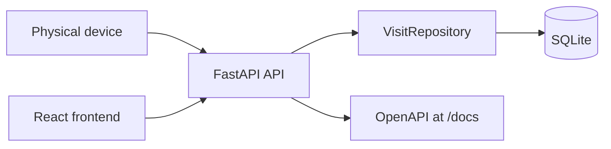

# Tree Nation Visit Tracker

A small full-stack implementation of the assessment in [Tech Interview Assessment Spec.pdf](Tech%20Interview%20Assessment%20Spec.pdf).

- `backend/`: FastAPI service with SQLite persistence and Docker support.
- `frontend/`: React + TypeScript + Vite dashboard for hourly visit aggregates.

## Run With Docker

From the repository root, create the real environment file from the example and start the stack:

```bash
cp .env.example .env
docker compose up --build -d
```

The frontend runs at http://localhost:5173, the API runs at http://localhost:8000, and the OpenAPI docs are available at http://localhost:8000/docs.

Configuration lives in the root `.env` file, which Docker Compose reads automatically. The tracked `.env.example` file documents the available values, but Compose does not use it.

Default values:

- `API_PORT=8000`: host port for the FastAPI backend.
- `FRONTEND_PORT=5173`: host port for the frontend.
- `DATABASE_PATH=/data/visits.db`: SQLite file path inside the backend container.
- `TEST_DATABASE_PATH=/tmp/test-visits.db`: SQLite file path used by the test container.
- `VISITS_PER_TREE=5`: number of visits that equal one planted tree.
- `VITE_API_BASE_URL=http://localhost:8000`: API URL baked into the frontend build.

After changing `.env`, run `docker compose up --build -d` again. The rebuild matters for `VITE_API_BASE_URL` because Vite embeds it when the frontend image is built.

## Run Backend Tests

```bash
docker compose --profile test run --rm test
```

## Frontend: Run Locally

Docker is the easiest path for reviewers, but local frontend development still works normally from the repository root:

```bash
npm --prefix frontend install
npm --prefix frontend run dev
```

Run the backend in another terminal with:

```bash
docker compose up --build -d api
```

Open http://localhost:5173. The frontend expects the API at `http://localhost:8000` by default.

## API Documentation

Once the backend is running, the interactive OpenAPI documentation is hosted at http://localhost:8000/docs.

## Assumptions

- `customer_id` is provided by the device and is enough to identify a customer.
- Visit timestamps are stored and returned in UTC.
- A tree milestone is calculated as `floor(customer visits / VISITS_PER_TREE)`.
- SQLite is sufficient for this scope and is persisted through a Docker volume.
- The frontend is a separate app that can run through Docker or the local Vite dev server.

## Architecture



See [docs/decisions.md](docs/decisions.md) for the short decision document.
